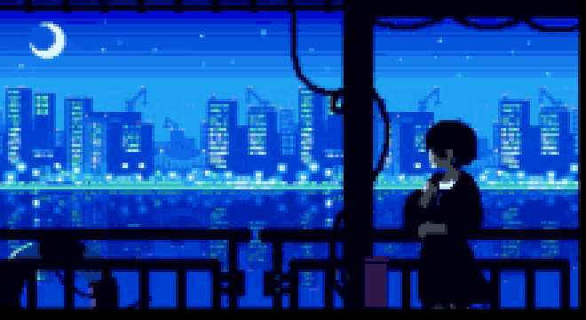

  <!-- Top Anime Chill GIF Banner -->
  

    

  <!-- Big ZamaDayo Title -->
  <h1>⚡ ZamaDayo505 ⚡</h1>

  <!-- Typing Animation -->
  

    

  <!-- Tech Stack & Tools -->
  <h3>🛠️ Tech Stack &amp; Tools</h3>
  

    

  <!-- Compact Spotify Widget -->
  <h3>🎧 Now Playing</h3>
  

    

  <!-- Animated Green Contribution Grid -->
  <h3>📊 Contribution Activity</h3>
  

