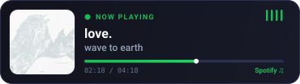

  <!-- Anime Hologram Header -->
  

    

  <!-- Typing Animation -->
  

    

  <!-- Tech Stack & Tools -->
  <h3>🛠️ Tech Stack &amp; Tools</h3>
  

    

  <!-- Spotify & Retro Pixel Anime GIF Showcase -->
  <h3>🎧 Now Playing</h3>
  

    
    
  

    

  <!-- Animated Green Contribution Grid -->
  <h3>📊 Contribution Activity</h3>
  

